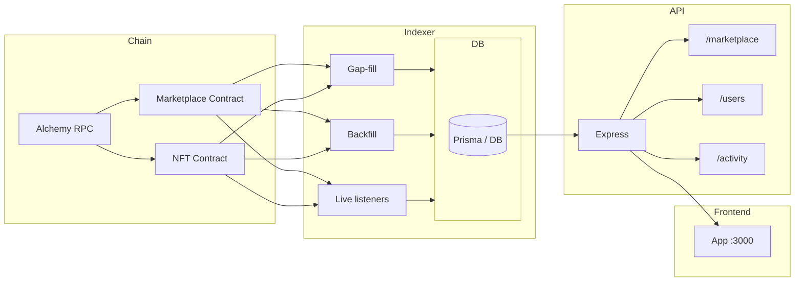

# Architecture

High-level flow: **Chain → Indexer → DB → API → Frontend**. Gap-fill and backfill are part of the indexer layer.

---

## Diagram (Mermaid)



---

## Text diagram

```
┌─────────────────────────────────────────────────────────────────────────────┐
│ CHAIN                                                                        │
│   Alchemy RPC  →  Marketplace contract  /  NFT contract (events)             │
└───────────────────────────────┬─────────────────────────────────────────────┘
                                │
                                ▼
┌─────────────────────────────────────────────────────────────────────────────┐
│ INDEXER                                                                      │
│                                                                              │
│   • Gap-fill (on startup)                                                    │
│     From last indexed block → latest block (chunked).                        │
│     Uses same backfill logic; catches up after downtime.                     │
│                                                                              │
│   • Backfill (one-off or script)                                             │
│     From config START_BLOCK → latest. Full historical sync.                 │
│     e.g. node dist/indexer/marketplace-backfill.js                           │
│                                                                              │
│   • Live listeners                                                           │
│     Contract.on("NFTListed", …) etc. Real-time events → DB.                  │
│                                                                              │
└───────────────────────────────┬─────────────────────────────────────────────┘
                                │
                                ▼
┌─────────────────────────────────────────────────────────────────────────────┐
│ DB                                                                           │
│   Prisma  →  listings, NFTs, activities, indexer state (last block)         │
└───────────────────────────────┬─────────────────────────────────────────────┘
                                │
                                ▼
┌─────────────────────────────────────────────────────────────────────────────┐
│ API                                                                          │
│   Express  →  /marketplace  /users  /activity                                │
└───────────────────────────────┬─────────────────────────────────────────────┘
                                │
                                ▼
┌─────────────────────────────────────────────────────────────────────────────┐
│ FRONTEND                                                                     │
│   App (e.g. localhost:3000)                                                  │
└─────────────────────────────────────────────────────────────────────────────┘
```

---

## Where gap-fill and backfill sit

| Piece      | When it runs                         | What it does |
|-----------|---------------------------------------|--------------|
| **Gap-fill** | Every time the indexer starts (`startIndexer()` → `runGapFill()`) | Reads last indexed block from DB, then backfills from that block + 1 up to current chain head (in chunks, e.g. 2000 blocks). Brings DB up to date after restarts or downtime. |
| **Backfill** | One-off (e.g. run `marketplace-backfill` script) or first-time setup | Full historical sync from a fixed `START_BLOCK` to latest. Same event-processing logic as gap-fill, but from a defined start instead of “last indexed block”. |

Both use the same **backfill functions** (`backfillMarketplaceFromBlock`, `backFillERC721TransfersFromBlock`); gap-fill just chooses the range from DB state, while the backfill script uses a config start block.

---

## Startup flow

1. Express server starts and mounts routes.
2. `main()` runs and calls `startIndexer()` (inside try/catch).
3. Indexer runs **gap-fill** (catch up from last block to latest).
4. Indexer starts **live listeners** (marketplace + NFT).
5. New chain events go to DB; API serves data to the frontend.
